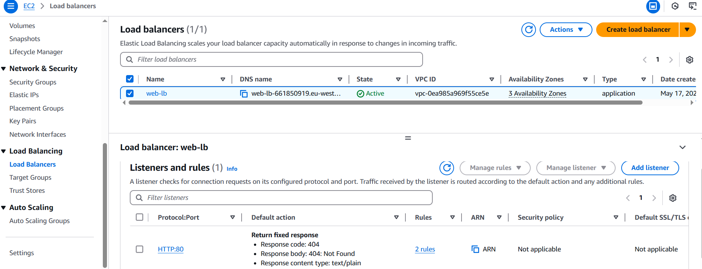

### This repo contains IaaC setup for AWS using Terraform

1. `terraform init` -> `terraform plan` -> `terraform apply`
2. Check http call returns "Hello world" via `http://{alb_dns_name}` or `curl http://{alb_dns_name}`
```
curl http://web-lb-661850919.eu-west-2.elb.amazonaws.com/  


StatusCode        : 200
StatusDescription : OK
Content           : Hello, World!

RawContent        : HTTP/1.1 200 OK
                    Connection: keep-alive
                    Accept-Ranges: bytes
                    Content-Length: 14
                    Content-Type: text/html
                    Date: Sat, 17 May 2025 20:13:54 GMT
                    ETag: "6828e9a4-e"
                    Last-Modified: Sat, 17 May 2025 19:...
Forms             : {}
Headers           : {[Connection, keep-alive], [Accept-Ranges, bytes], [Content-Length, 14], [Content-Type, text/html]...}    
Images            : {}
InputFields       : {}
Links             : {}
ParsedHtml        : mshtml.HTMLDocumentClass
RawContentLength  : 14

```
3. To visualize connections run `terraform graph > graph.json` -> copy content to https://dreampuf.github.io/GraphvizOnline/ to get visualization (see img below)
4. `terraform destroy` -> `terraform show` (to make sure nothing remains)

___

Setup on AWS:

EC2


Autoscaling group


Security group for EC2


Security group for Load Balancer


Load Balancer with Listener and Rules


Basic visualization:

